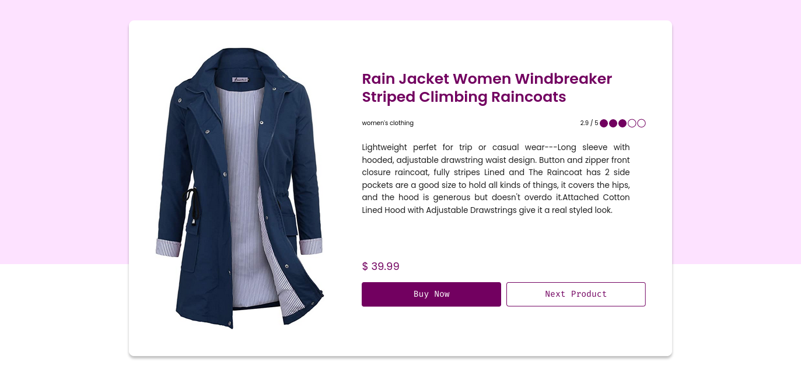

# ecommerce catalog - Core Initiative Final Task

## Hint

- [x] Kalian akan mengakses sebuah API sebuah ecommerce,

- [x] Silakan membuka https://fakestoreapi.com/docs untuk mendapatkan informasi mengenai API E-Commerce ini
- [x] Pada projek VueJS yang telah dibuat, silakan fetch API dengan endpoint https://fakestoreapi.com/products/index yang mana index adalah angka 1-20
- [x] Panggil API saat user menekan tombol Next Product, silakan gunakan increment untuk menambah index di setiap user menekan tombol tersebut. Index inilah yang nanti digunakan untuk fetch API di step nomor 2
- [x] Setelah mendapat balasan dari API, gunakan kondisi untuk mengecek jika category = men’s clothing atau category = women’s clothing, maka simpan balasan tersebut pada variable yang telah dibuat di data(), jika category selain 2 di atas, maka jangan simpan balasannya
- [x] Untuk menghindari error saat fetch API, ketika index sudah mencapai 20, maka atur index supaya kembali ke 1 karena API hanya menyediakan 20 jenis produk

## Project Setup

```sh
npm install
```

### Compile and Hot-Reload for Development

```sh
npm run dev
```

### Compile and Minify for Production

```sh
npm run build
```

## Preview



